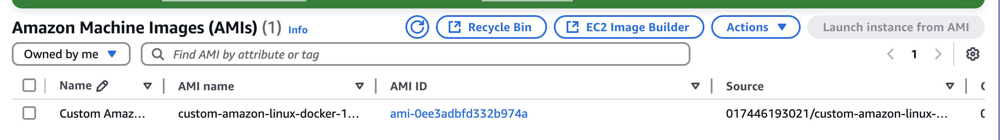
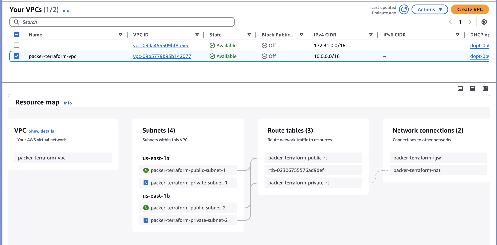
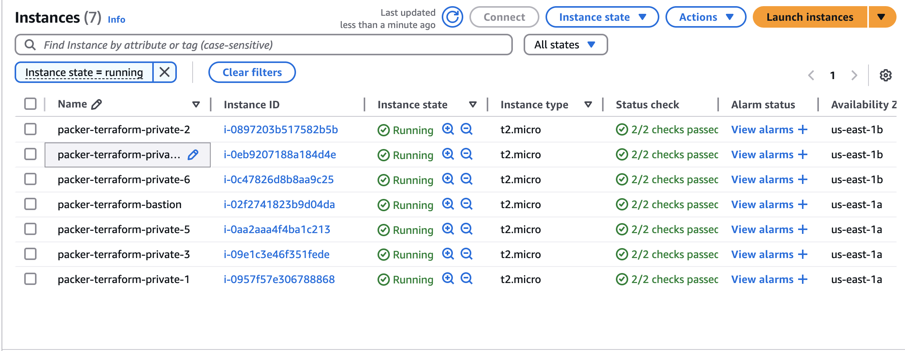
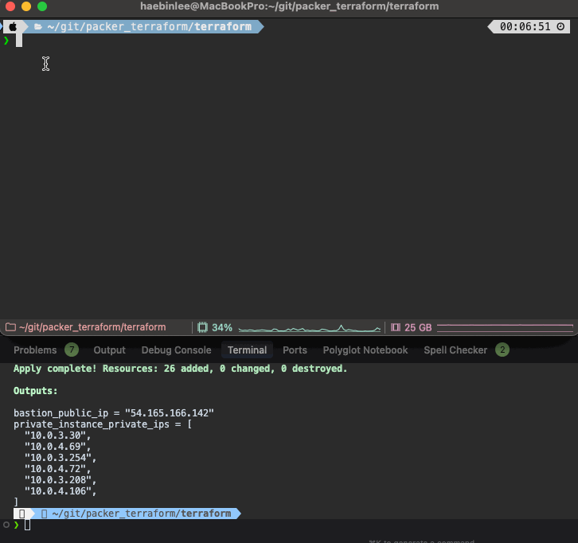

# AWS Infrastructure with Custom AMI

This project demonstrates the creation of a custom Amazon Linux AMI with Docker using Packer, and the deployment of a complete AWS infrastructure using Terraform. The infrastructure includes a VPC with public and private subnets, a bastion host, and multiple EC2 instances running the custom AMI.

## Prerequisites

- AWS CLI configured with appropriate credentials
- Packer installed
- Terraform installed
- Your public IP address (for bastion host access)

## Getting Started

### 1. Create SSH Key Pair

First, create a directory for Packer files and generate an SSH key pair:

```bash
mkdir -p packer/packer_files
ssh-keygen -t rsa -b 4096 -f packer/packer_files/packer_key -N ""
```

### 2. Build Custom AMI with Packer

Navigate to the packer directory and build the AMI:

```bash
cd packer
packer build main.pkr.hcl
```

This will create a custom AMI with:

- Amazon Linux 2023
- Docker installed
- SSH access configured with your public key

### 3. Deploy Infrastructure with Terraform

1. Update the `terraform.tfvars` file with your AMI ID and public IP:

```bash
cd ../terraform
# Update ami_id created by Packer and allowed_ip with your current IP in terraform.tfvars
```

2. Initialize Terraform:

```bash
terraform init
```

3. Review the planned changes:

```bash
terraform plan
```

4. Apply the infrastructure:

```bash
terraform apply
```

## Infrastructure Components

### VPC Configuration

- VPC with CIDR block 10.0.0.0/16
- 2 Public Subnets (10.0.1.0/24, 10.0.2.0/24)
- 2 Private Subnets (10.0.3.0/24, 10.0.4.0/24)
- Internet Gateway
- NAT Gateway
- Appropriate route tables

### EC2 Instances

- 1 Bastion Host in public subnet (SSH access from your IP only)
- 6 EC2 instances in private subnet running the custom AMI

## Security

- Bastion host is only accessible from your specified IP address
- Private instances are not directly accessible from the internet
- All instances use the same SSH key pair for access
- Security groups are configured to allow necessary traffic

## Cleanup

To destroy the infrastructure:

```bash
cd terraform
terraform destroy
```

## Screenshots

- AMI
  
- VPC
  
- EC2
  
- Bastion and private EC2 Test
  

## Notes

- Make sure to replace the SSH public key in the Packer configuration with your own
- Update the allowed IP address in the bastion host security group
- The custom AMI ID will be automatically used in the Terraform configuration
